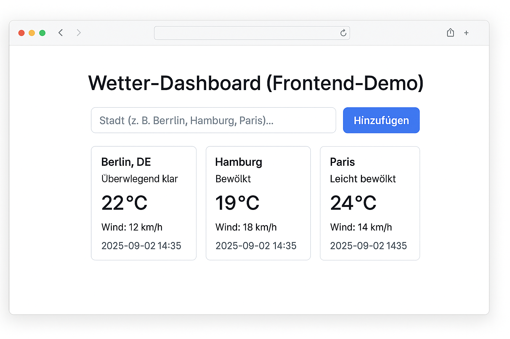

# Wetter-Dashboard (Frontend)

> Diese Umsetzung konzentriert sich bewusst auf das **Frontend**. Die Widget-Liste (Städte) wird im **Browser** gespeichert (localStorage), die **Wetterdaten** werden **direkt** aus dem Browser von **Open‑Meteo** geladen (kein API‑Key erforderlich).  
> Ein Backend (Node/Express, MongoDB, Server‑Cache) ist **noch nicht enthalten** – siehe Begründung & Roadmap.

---

### 📸 Screenshot


## Motivation & Begründung (Warum noch kein Backend?)

Als **Quereinsteiger (Frontend)** fehlt mir aktuell **Praxisroutine** in
- **Node.js/Express** (Routing, Middleware, Auth),
- **MongoDB** (Schema-Design, Indizes, Verbindungs-Management),
- **Caching** (In‑Memory, Redis, Cache‑Invalidierung),
- **Deployment/CI/CD** (Env‑Handling, Secrets, Monitoring).

Ich kenne mich bisher nur im Frontend aus und lerne Backend gerade erst kennen. Im Rahmen der Aufgabe habe ich mir die Zielarchitektur grundlegend angeschaut (REST-Endpunkte wie /widgets, MongoDB als Datenbank, ein einfacher 5-Minuten-Cache für Wetterdaten). Für die erste Umsetzung würde ich eng mit einer erfahrenen Backend-Person zusammenarbeiten und mir die Themen praxisnah erklären lassen. Konkret bräuchte ich Unterstützung bei:

- API-Entwurf gemeinsam festhalten – die Schnittstellen zuerst schriftlich definieren (OpenAPI/Swagger), damit Frontend und Backend exakt zueinander passen.
- Caching sinnvoll aufsetzen – z. B. mit Redis; verstehen, wann gecacht wird, wie lange und wann invalidiert werden muss.
- Datenmodell in MongoDB planen – sinnvolles Schema und Indizes wählen, damit Abfragen stabil und schnell sind.
- Fehler & Limits vereinbaren – einheitliche Statuscodes, verständliche Fehlermeldungen und Rate-Limits.
- Build & Deployment klären – Umgang mit Umgebungsvariablen/Secrets und eine einfache CI/CD-Pipeline.

--> Ziel ist, das Wissen hands-on zu übernehmen (Pair-Programming, Code-Reviews, kleine Lernaufgaben), sodass ich ähnliche Backend-Aufgaben künftig selbstständig umsetzen kann.

Für die **Frontend‑Demo** simuliere ich die Server‑Teile:
- **Persistenz**: `localStorage` im Browser (statt DB),
- **Wetterdaten**: direkte Abfrage bei Open‑Meteo (statt Backend‑Service),
- **Cache**: einfacher **Client‑Cache** (5‑Min‑TTL) im Browser.

---

## Ziele der Demo

- Städte‑Widgets **hinzufügen**, **anzeigen**, **löschen**  
- Wetter je Stadt: **Temperatur, Wind, Kurztext, Zeit**  
- **Duplikat‑Schutz** (eine Stadt nur einmal)  
- **Persistenz** im Browser (Reload‑sicher)  
- **Client‑Cache** (5 Minuten) zur Performance‑Verbesserung

---

## Technik-Stack

- **Next.js** (Pages‑Router), **React Hooks**  
- **localStorage** als einfache Persistenz (kein Backend)  
- **Open‑Meteo** (Geocoding + Current Weather) direkt im Client  
- **Plain CSS‑in‑JS (inline styles)** für minimale UI (Fokus: Logik)

---

## Schnellstart

Voraussetzungen: **Node.js ≥ 18**, npm

```bash
cd frontend
npm install
npm run dev
# Browser: http://localhost:3000
```

Ablauf testen:
1. Stadt (z. B. **Berlin**) eingeben → **Hinzufügen**  
2. Widget zeigt Temperatur/Wind/Zustand/Zeit  
3. Nochmal „Berlin“ → **Fehlermeldung** (Duplikat geschützt)  
4. **Löschen** testen

---

## Projektstruktur

```
frontend/
├─ components/
│  └─ WidgetCard.jsx        # UI-Komponente für ein Widget
├─ hooks/
│  └─ useWidgets.js         # zentraler React-Hook: Zustand + Wetter-Anreicherung + CRUD
├─ utils/
│  ├─ storage.js            # Persistenz ohne Backend (localStorage)
│  └─ weather.js            # Open-Meteo (Geocoding + Current) + 5-Min-Client-Cache
└─ pages/
   └─ index.js              # Seite/Flows (Form, Liste, Fehler, Loading)
```

---

## Detaillierte Erklärung des Frontend-Codes

### `utils/weather.js` – Wetter & Geocoding & Client-Cache

**Aufgabe**
- **Geocoding** (Stadtname → `lat/lon/label`) via Open‑Meteo Geocoding‑API  
- **Current Weather** (Koordinaten → Temperatur, Wind, Wettercode) via Open‑Meteo Forecast‑API  
- **WMO‑Mapping**: Wettercode → kurzer, lesbarer Text  
- **Cache (Map + TTL)**: 5‑Minuten‑Zwischenspeicher pro Location

**Warum so?**  
Open‑Meteo trennt Geocoding & Wetter. Der Client‑Cache reduziert Netzlast und macht die UI schneller, ohne komplexen Server‑Cache.

**Kernlogik (verkürzt)**
```js
const cache = new Map();
const TTL_MS = 5 * 60 * 1000;

export async function getWeatherByLocation(location) {
  const key = location.trim().toLowerCase();
  const hit = cache.get(key);
  if (hit && Date.now() - hit.ts < TTL_MS) return hit.data;

  const { lat, lon, label } = await geocode(location);
  const current = await getCurrentWeather(lat, lon);
  const data = { locationLabel: label, lat, lon, current };
  cache.set(key, { data, ts: Date.now() });
  return data;
}
```

---

### `utils/storage.js` – Persistenz ohne Backend

**Aufgabe**  
- `localStorage` als kleine „Datenbank“ (Key: `widgets`)  
- CRUD‑ähnliche API für die Widgetliste

**Warum so?**  
Ohne Backend brauchen wir trotzdem ein stabiles Verhalten: Reload‑sicher, Duplikat‑Schutz, eindeutige IDs.

**Kernlogik (verkürzt)**
```js
const KEY = 'widgets';

export function addWidget(location) {
  const list = JSON.parse(localStorage.getItem(KEY)) || [];
  const exists = list.some(w => w.location.toLowerCase().trim() === location.toLowerCase().trim());
  if (exists) { const e = new Error('Widget existiert bereits'); e.status = 409; throw e; }
  const w = { id: Date.now() + '_' + Math.random().toString(36).slice(2,8), location: location.trim(), createdAt: new Date().toISOString() };
  localStorage.setItem(KEY, JSON.stringify([w, ...list]));
  return w;
}
```

---

### `hooks/useWidgets.js` – Zustand & Datenfluss

**Aufgabe**  
- Zentraler Hook, den die Seite verwendet  
- Hält **Roh‑Widgets** (nur `id, location, createdAt`) und eine **angereicherte Liste** (inkl. `weather`) getrennt  
- Kapselt **Add/Delete** & **Fehler/Loading**

**Warum so?**  
Trennt **Datenquelle** (hier `storage.js` + Open‑Meteo) von der UI. Späterer Wechsel auf echte API = nur diese Schicht anpassen.

**Kernlogik (verkürzt)**
```js
useEffect(() => { setItems(getAllWidgets()); }, []);

useEffect(() => {
  let cancel=false;
  (async () => {
    setLoading(true); setError('');
    const withWeather = await Promise.all(items.map(async w => {
      try { const weather = await getWeatherByLocation(w.location); return { ...w, weather }; }
      catch (e) { return { ...w, weather: { error: e.message } }; }
    }));
    if (!cancel) setEnriched(withWeather);
    setLoading(false);
  })();
  return () => { cancel = true; };
}, [items]);
```

---

### `components/WidgetCard.jsx` – Anzeige & Aktionen

**Aufgabe**  
- Darstellung **pro Widget**, inkl. Fehlerfall  
- Button **„Löschen“** ruft Callback des Hooks

**Warum so?**  
Klare Trennung von **Darstellung** (Card) und **Logik** (Hook/Seite). Fehler sind **lokal pro Widget** sichtbar → bessere UX.

---

### `pages/index.js` – Seite & Flows

**Aufgabe**  
- Steuert den **Form‑Flow** (Hinzufügen)  
- Bindet den Hook ein, rendert die Liste, zeigt **globale Fehler/Loading** an

**Warum so?**  
Der Seiten‑Code bleibt schlank: State/Logik lebt im Hook, Datenquelle in `utils`. Das erleichtert Tests, Refactoring & späteren Backend‑Umstieg.

**Flow**  
1) Nutzer tippt Stadt → `onSubmit` validiert → `addWidget(value)`  
2) Hook aktualisiert `items` → Effekt lädt Wetter → `items (enriched)` rendern  
3) `onDelete(id)` entfernt → Hook rendert neu

---

## Was ich als Quereinsteiger hierbei lerne

- **State‑Management** mit React Hooks (Effekte, asynchrone Daten, Cancellation‑Pattern)  
- **Saubere Schichtentrennung** (UI ↔ Hook/Logik ↔ Datenquelle)  
- **API‑Austauschbarkeit** vorbereiten (Mock → echte REST)  
- **Fehlerbehandlung** nutzerfreundlich (pro Widget & global)  
- **Performance‑Denken** (einfacher Cache) ohne Überkomplexität
